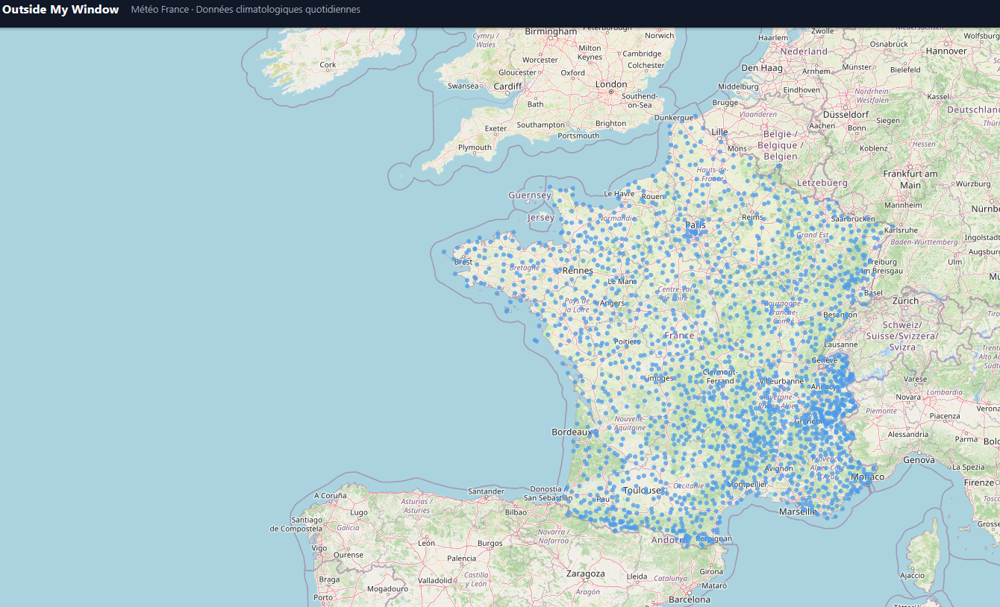
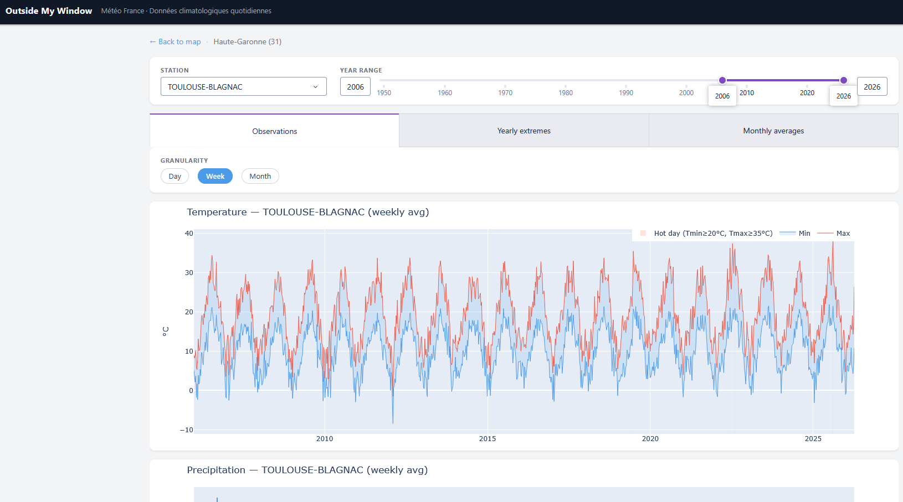
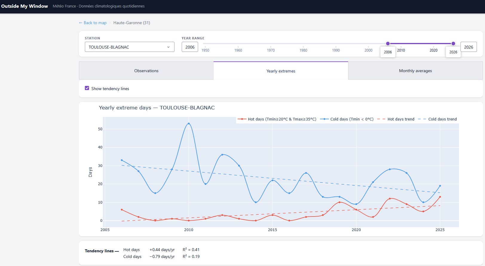
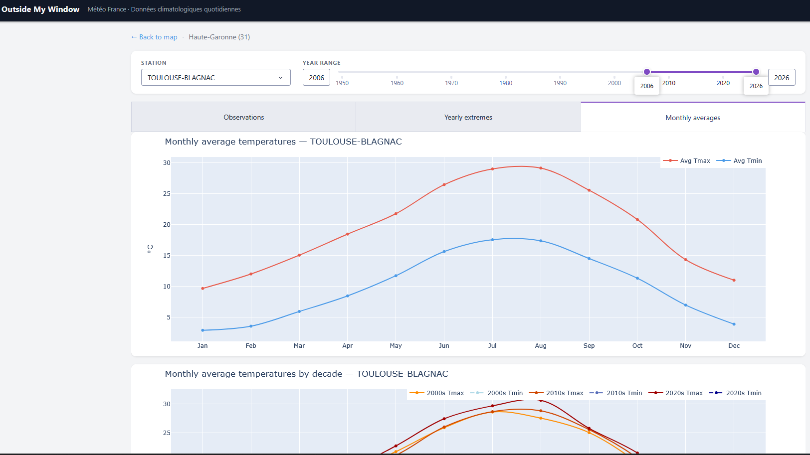

# Outside My Window

[](https://github.com/PierreSelim/outside-my-window/actions/workflows/ci.yml)
[](https://codecov.io/gh/PierreSelim/outside-my-window)

Visualization app for French daily climatological data from Météo-France ([data.gouv.fr](https://www.data.gouv.fr/datasets/donnees-climatologiques-de-base-quotidiennes)).

Select a department, a weather station, and a year range to explore temperature, precipitation, and wind history.

## Requirements

- Python 3.13+
- [uv](https://docs.astral.sh/uv/)

## Build the station index

The map requires a pre-built index of all stations. Run this once (and again if the station network changes):

```bash
uv run python scripts/build_station_index.py
```

This fetches the latest-period file for each department sequentially and writes `data/stations.json`.

## Build the resource index

Downloads use stable data.gouv.fr permalinks resolved from `data/resources.json`. Rebuild it only if the dataset re-issues resources with new ids:

```bash
uv run python scripts/build_resource_index.py
```

## Run the app

```bash
uv run python app.py
```

Then open [http://127.0.0.1:8050](http://127.0.0.1:8050) in your browser.

The landing page is a map of all stations. Click a station to view its temperature, precipitation, and wind history. Department data is fetched from Météo-France on first visit and cached locally under `data/cache/`.

## Run as a desktop app (Electron)

**Additional requirements:** [Node.js](https://nodejs.org/) (includes npm)

```bash
npm install        # install Electron (one-time)
npm start          # launch the desktop window
```

This starts a local [waitress](https://docs.pylonsproject.org/projects/waitress/) server on a random port (8050–8149) and opens it in an Electron window. The Python sidecar is killed automatically when you close the window.

Data is cached for 6 hours; press **Ctrl+Shift+R** (**Cmd+Shift+R** on macOS) to force-refresh the latest data immediately instead of waiting for the cache to expire.

The `uv run python app.py` workflow above still works for browser-based development.

## Run the tests

```bash
uv run pytest tests/ --cov=src --cov-report=term-missing
```

## Features

### Station map
Browse all Météo-France stations across metropolitan France and overseas departments. Click any marker to navigate directly to that station's history.



### Daily observations
Explore daily temperature (min/max band), precipitation, and wind for any station and year range. Switch between daily, weekly, and monthly granularity.



### Yearly extremes
Track hot days (Tmin ≥ 20 °C and Tmax ≥ 35 °C) and cold days (Tmin < 0 °C) year by year. Optional trend lines show the long-term evolution with slope and R².



### Monthly averages
Compare average Tmin and Tmax by month of year, either over the full record or broken down by decade to visualise long-term shifts.


